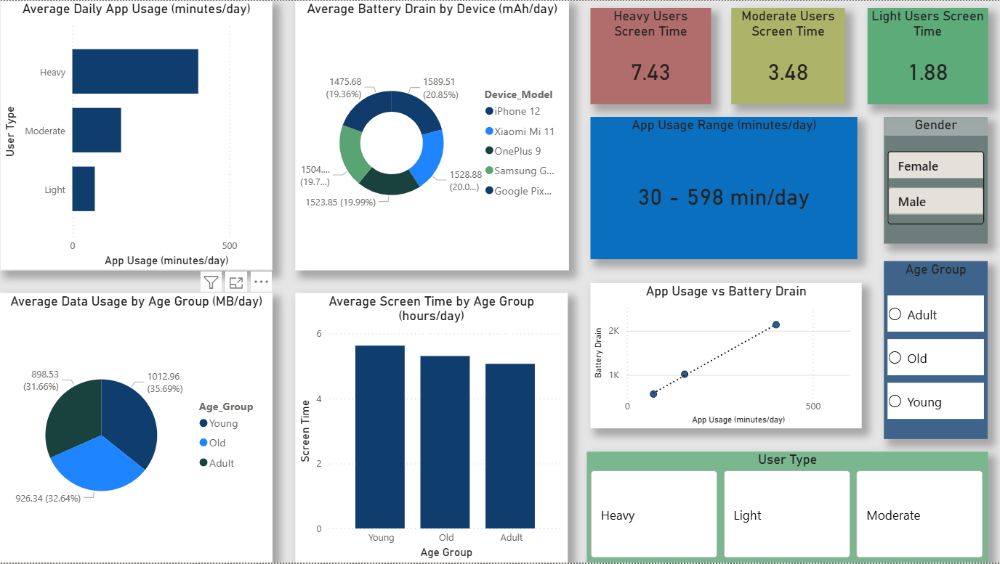
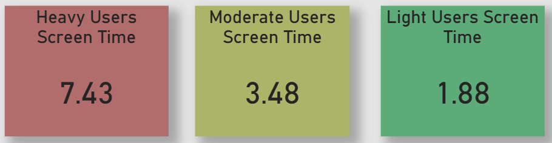
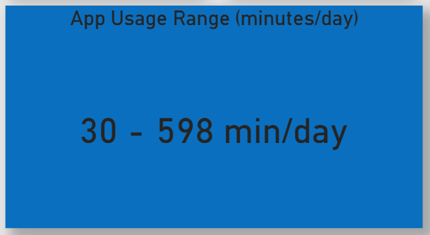
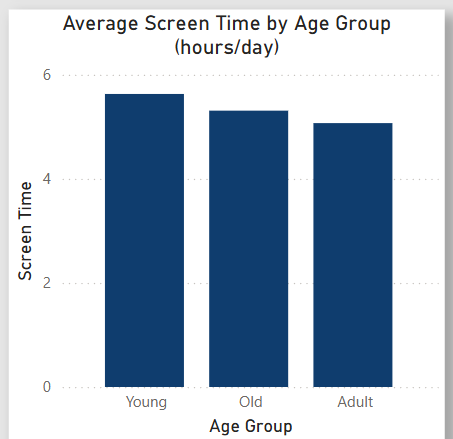

# 📊 Mobile Usage Analysis Dashboard (Power BI)

## 📌 Overview
This project presents an interactive Power BI dashboard analyzing mobile usage behavior, screen time patterns, and battery consumption across different user groups. The dashboard provides clear, data-driven insights through intuitive visualizations.

---

## 🎯 Objective
- Analyze user behavior based on screen time and app usage  
- Compare usage patterns across different age groups  
- Understand the impact of usage intensity on battery consumption  
- Enable interactive exploration using filters and visuals  

---

## 🛠️ Tools & Technologies
- Power BI  
- Data Modeling  
- DAX  
- Data Visualization  

---

## 📊 Dashboard Preview

**Dashboard Overview**  

**Key Performance Indicators - Screen Time**  

**Key Performance Indicators - App Usage**  

**Screen Time by Age Group**  

---

## 📈 Key Insights
- Heavy users exhibit significantly higher screen time and battery consumption compared to moderate and light users  
- Younger users tend to spend more time on mobile devices than older age groups  
- Increased app usage directly correlates with higher battery drain  
- User behavior patterns vary clearly across usage categories  

---

## 🔍 Features
- Interactive filters for Age Group, Gender, and User Type  
- KPI cards highlighting key metrics  
- Comparative analysis across multiple dimensions  
- Clean and user-friendly dashboard design  

---

## 📁 Dataset
The dataset used in this project is included in the repository.

---

## 🎯 Conclusion
This dashboard demonstrates how Power BI can be used to transform raw data into meaningful, interactive insights, enabling better understanding of user behavior and supporting data-driven decisions.

---
